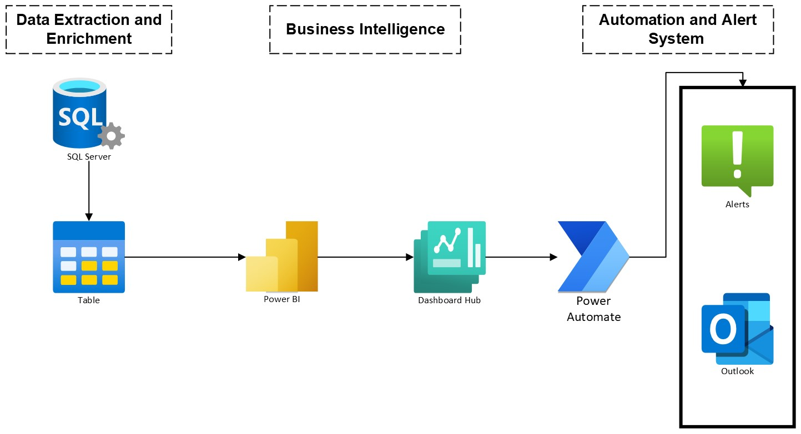

# Creating-Exemption-Report-in-PowerBI 

## Project Overview
The Exemption Report Project was designed to identify and report instances where call data entries did not match predefined values in a lookup table within the database. The primary components of the project include a Power BI report, a Power Automate flow, and underlying SQL code that feeds the report. The project's main feature is an alert system that notifies stakeholders when certain thresholds are reached, indicating potential issues in the data mapping process.

## Process Flow

## Repository Contents
Exemption_Report_Flow.zip: A compressed file containing the exported Power Automate flow.
Source_SQL_Code.sql: The SQL scripts used to extract and process the data from the database.
Exemption_Report.pbit: The Power BI template file for the exemption report.
Exemption_Report_Sample.pdf/jpg: A visual sample of the Power BI report and the configured flow in Power Automate.

## Report Features
Unmapped Records Tracking: Counts and details entries for campaigns labeled as "Unknown" to highlight data not conforming to the expected mapping.
Threshold Alerting: Establishes a threshold for the number of unmapped entries and triggers an alert if this threshold is exceeded.
Automated Notifications: Uses Power Automate to send automated email notifications to selected users when the data-driven alert is triggered.

## Workflow Steps
Data Extraction: SQL code is run against the database to retrieve call data and check against the lookup table for unmapping.
Power BI Reporting: A Power BI report is generated from the SQL data to visually represent the exemption instances.
Dashboard Setup: The report is published to a Power BI dashboard, allowing for real-time monitoring and threshold settings for alerts.
Alert Configuration: Alerts are configured in Power BI to trigger based on specified conditions (e.g., a certain number of unmapped entries).
Power Automate Flow: A flow is set up in Power Automate to send an email notification when the Power BI alert is triggered.
Testing and Validation: The entire system is tested to ensure that data is correctly extracted, reports are accurate, and notifications are sent as expected.

## Usage
To use the components in this repository, follow the instructions provided within each file for deployment and configuration. Ensure that you have the necessary permissions and access to the database, Power BI service, and Power Automate.

## Additional Considerations
Data Privacy Compliance: Ensure that all data handling complies with relevant data privacy laws and company policies.
Error Handling: Implement error handling within the SQL scripts and Power Automate flow to manage any exceptions or unexpected behavior.
Documentation: All components are documented for maintainability and ease of understanding for future users or maintainers of the project.

## Conclusion
This project demonstrates a comprehensive approach to data quality management, using a combination of SQL, Power BI, and Power Automate to monitor and alert on data exemptions. It is a valuable asset for database administrators, business analysts, and stakeholders concerned with data integrity.

For a detailed understanding of the implementation and to view the sample outputs, refer to the Exemption_Report_Sample.pdf/jpg and examine the Exemption_Report_Flow.zip for the Power Automate configuration. Use Source_SQL_Code.sql to set up the data source and customize the Exemption_Report.pbit as needed for your specific Power BI environment.
